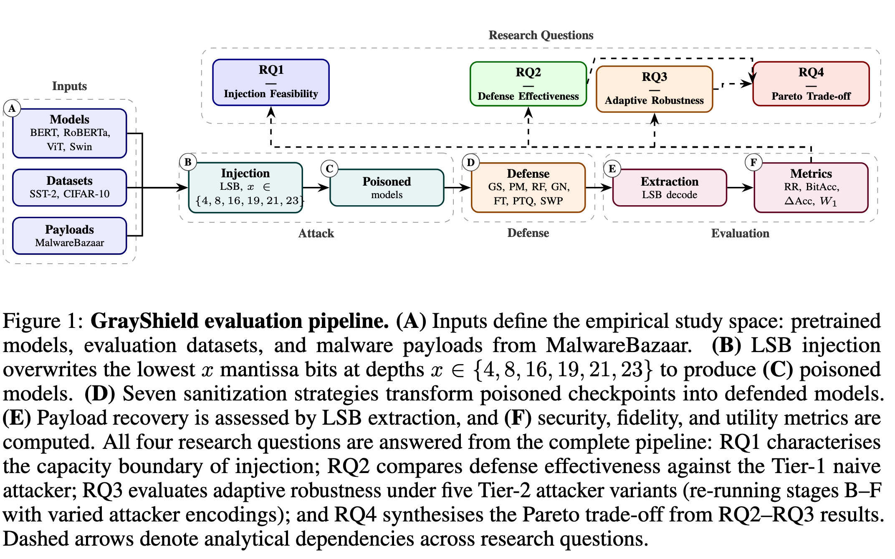

# GrayShield: Gray-Code-Guided Bit-Level Sanitization for Transformer Models

> Research code for studying LSB-based payload injection in transformer weights and defending against it with GrayShield, a post-training bit-level sanitization method.

Implementation for:
**"GrayShield: Gray-Code-Guided Bit-Level Sanitization for Transformer Models"**

Author and affiliation information withheld for double-blind review.

[](https://python.org)
[](https://pytorch.org)
[](LICENSE)

---

## Overview

This project evaluates how malware payloads can be injected into float32 weight mantissas and how different post-training defenses disrupt recovery while preserving model utility.



The pipeline above shows the end-to-end experimental structure used in the
repository: payload injection for `RQ1`, defense evaluation for `RQ2`,
adaptive-attacker robustness for `RQ3`, and Pareto-style trade-off analysis
for `RQ4`.

**GrayShield** is the main defense in this repository. In the current implementation:

- It overwrites the low `x` mantissa bits of targeted FP32 parameters with a Gray-code-guided mask.
- `V1` is seed-based and deterministic.
- `V2` uses an HMAC-derived keyed offset.
- `V3` extends `V2` with per-run salt and layer-aware domain separation.
- `scripts/exps.sh` enables **GrayShield V3 by default**.

The current experiment pipeline also includes matched baselines:

- `RandomFlip`
- `PatternMask`
- `GaussianNoise`
- `FineTune`
- `PTQ`
- `SWP`

Adaptive attacker variants currently implemented:

- `naive`
- `repeat3`
- `repeat5`
- `interleave`
- `rs` (`RS(255,127)`)

---

## Research Questions

| RQ | Goal | Standalone? | Notes |
|----|------|-------------|-------|
| `RQ1` | Injection feasibility vs. LSB depth | Yes | Payload injection only |
| `RQ2` | Defense effectiveness | Yes | Baseline defense comparison; naive attacker by default |
| `RQ3` | Robustness across attacker variants | Yes | Main adaptive-attacker experiment |
| `RQ4` | Aggregate trade-off visualization | No | Reads existing `RQ2` / `RQ3` outputs |

In practice:

- `RQ1`, `RQ2`, and `RQ3` can be run independently.
- `RQ4` depends on previously generated `rq2.jsonl` and/or `rq3.jsonl`.
- `scripts/exps.sh --rq all` runs them in the correct order.

---

## Installation

```bash
git clone https://github.com/anonymousgrayshield/grayshield.git
cd grayshield

conda create -n grayshield python=3.10
conda activate grayshield

pip install -r requirements.txt
```

If you prefer `venv`:

```bash
python -m venv .venv
source .venv/bin/activate
pip install -r requirements.txt
```

---

## Quick Start

### 1. Run the reviewer smoke test

The anonymous public repository intentionally does **not** ship executable
malware binaries.  It includes benign byte payloads for smoke testing and the
curated result artifacts used by the paper.

```bash
bash scripts/smoke_test.sh
```

This verifies imports, payload bit encoding/decoding, LSB injection,
GrayShield sanitization, and table regeneration from `release_results/`.

### 2. Optional: rehydrate paper payloads in a controlled environment

The main-paper payloads are real MalwareBazaar samples and should be handled
only in an isolated research environment.  For double-blind review, use the
anonymous dataset identifier provided with the submission package:

```bash
export GRAYSHIELD_HF_DATASET_ID=<anonymous-dataset-id>
python data/download_from_hf.py
```

If the dataset identifier is not available, reviewers can still run the smoke
test and regenerate all included plots/tables from `release_results/`.

### 3. Run the main paper pipeline

Recommended:

```bash
bash scripts/exps.sh \
  --phase main \
  --rq all \
  --output-dir results/$(date +%F_%H%M)_complete \
  --visualize
```

Notes:

- `--phase main` uses the fixed 4-model main-paper set.
- Full main-paper reruns require the controlled paper payloads under
  `data/malware/`.
- `--visualize` runs centralized plotting after experiments complete.
- `experiment.log` is written to the output directory.
- Using `$(date +%F_%H%M)` avoids mixing multiple runs into one folder.

For a quick benign end-to-end check without the paper payloads:

```bash
bash scripts/exps.sh \
  --phase main \
  --rq rq1 \
  --models bert_sst2 \
  --payloads data \
  --no-paper-payloads \
  --n-payloads 1 \
  --n-eval 8 \
  --batch-size 4 \
  --dry-run
```

### 4. Re-generate plots from existing results

For a raw experiment directory:

```bash
bash scripts/exps.sh --visualize-only --output-dir results/2026-03-21_0200_complete
```

For the curated paper artifact bundle:

```bash
PYTHONPATH=. python grayshield/visualization/rq1.py --input_dir release_results/rq1 --output_dir release_results/rq1
PYTHONPATH=. python grayshield/visualization/rq2.py --input_dir release_results/rq2 --output_dir release_results/rq2
PYTHONPATH=. python grayshield/visualization/rq3.py --input_dir release_results/rq3 --output_dir release_results/rq3
python scripts/generate_tables.py --output_dir release_results/rq3
```

---

## Single-Command Examples

### RQ1: Injection Feasibility

```bash
python -m grayshield.cli rq1 \
  --model bert_sst2 \
  --task sst2 \
  --payload_path data/test_payload.bin \
  --x 4 \
  --mode encoder_only \
  --n_eval 8 \
  --batch_size 4 \
  --device cpu \
  --seed 42
```

### RQ2: Defense Effectiveness

```bash
python -m grayshield.cli rq2 \
  --model bert_sst2 \
  --task sst2 \
  --payload_path data/test_payload.bin \
  --x 4 \
  --mode encoder_only \
  --defense grayshield \
  --attacker_variant naive \
  --n_eval 8 \
  --batch_size 4 \
  --device cpu \
  --seed 42
```

### RQ3: Adaptive Attackers

```bash
python -m grayshield.cli rq3 \
  --model bert_sst2 \
  --task sst2 \
  --payload_path data/test_payload.bin \
  --x 4 \
  --mode encoder_only \
  --attacker_variants "naive,repeat3,repeat5,interleave,rs" \
  --defenses "random,pattern,gaussian,finetune,ptq,swp,grayshield" \
  --n_eval 8 \
  --batch_size 4 \
  --device cpu \
  --seed 42
```

### RQ4: Aggregate Existing RQ2/RQ3 Results

```bash
python -m grayshield.cli rq4 \
  --model bert_sst2 \
  --task sst2 \
  --payload_path data/test_payload.bin \
  --x 4 \
  --results_dir release_results/rq3 \
  --output_dir release_results/rq3 \
  --device cpu
```

---

## Main Runner

`scripts/exps.sh` is the main entry point. It:

- exports `PYTHONPATH`
- auto-loads or generates `.grayshield_key`
- enables `GRAYSHIELD_V3=1`
- runs `scripts/experiments.sh`
- optionally launches centralized visualization scripts

Common options:

| Option | Description | Default |
|--------|-------------|---------|
| `--rq` | `rq1`, `rq2`, `rq3`, `rq4`, `all` | `all` |
| `--phase` | `main` or `appendix` | `main` |
| `--task-type` | `text`, `vision`, `all` | `all` |
| `--models` | Explicit comma-separated preset list | unset |
| `--payloads` | Payload directory | `data` |
| `--output-dir` | Output directory | `results/YYYY-MM-DD` |
| `--x-bits` | Injection depth | `19` |
| `--attacker-variant` | RQ2 attacker encoding | `naive` |
| `--attacker-variants` | RQ3 attacker encodings | `naive,repeat3,repeat5,interleave,rs` |
| `--visualize` | Run plotting after experiments | off |
| `--visualize-only` | Plot only, no experiments | off |
| `--dry-run` | Print generated commands without executing them | off |

Important behavior:

- With `--phase main`, the scripts ignore `--task-type` and use the fixed main-paper model set.
- Main-phase paper reruns use the two SHA256-matched payloads under
  `data/malware` by default.  These files are not included in the public
  anonymous GitHub repository; rehydrate them only through the controlled
  anonymous dataset channel.
- `RQ4` aggregates results already written by `RQ2` and `RQ3`.

---

## Defense Strategies

| Defense | Type | Main Parameters | Current Role |
|---------|------|-----------------|--------------|
| `grayshield` | Gray-code-guided LSB sanitization | `x`, `GRAYSHIELD_KEY`, `GRAYSHIELD_V3` | Main defense |
| `random` | Random LSB flipping | `flip_prob` | Stochastic baseline |
| `pattern` | Fixed-pattern overwrite | `pattern` | Deterministic baseline |
| `gaussian` | Additive FP32 noise | `sigma` | Continuous perturbation baseline |
| `finetune` | Small clean-data fine-tune | `finetune_steps`, `finetune_lr` | Data-dependent baseline |
| `ptq` | Static 8-bit projection with calibration | `ptq_calibration_samples`, `ptq_calibration_batches` | Quantization baseline |
| `swp` | Selective low-magnitude perturbation | `swp_fraction` | Matched lightweight baseline |

### GrayShield versions

| Version | Description | How it is activated |
|---------|-------------|---------------------|
| `v1` | Seed-based Gray-code masking | No key |
| `v2` | HMAC-keyed masking | `GRAYSHIELD_KEY` set |
| `v3` | `v2` + per-run salt + layer-specific domain separation | `GRAYSHIELD_KEY` + `GRAYSHIELD_V3=1` |

`scripts/exps.sh` runs **V3 by default**.

---

## Attacker Variants

| Variant | Mechanism | Expansion | Notes |
|---------|-----------|-----------|-------|
| `naive` | Direct bit injection | `1x` | Baseline attacker |
| `repeat3` | 3x repetition + majority vote | `3x` | Simple ECC |
| `repeat5` | 5x repetition + majority vote | `5x` | Stronger repetition ECC |
| `interleave` | Deterministic permutation of payload bits | `1x` | Burst-error resilience |
| `rs` | Chunked `RS(255,127)` byte-level code | about `2x` | Strong ECC attacker aligned with paper |

`rs` is implemented in-repo via `grayshield/payload/reed_solomon.py` and is integrated into the same `encode_payload / decode_payload` path as the other attacker variants.

---

## Default Experiment Scope

### Main phase

`--phase main` uses:

- Models: `bert_sst2`, `roberta_sentiment`, `vit_cifar10`, `swin_cifar10`
- Payloads: the fixed low-entropy and high-entropy SHA256-matched samples
- Defenses: `random, pattern, gaussian, finetune, ptq, swp, grayshield`

### Appendix phase

The default appendix preset expands to:

- `bert_imdb`
- `bert_sst2`
- `distilbert_sst2`
- `roberta_sentiment`
- `vit_cifar10`
- `swin_cifar10`

---

## Release Artifacts

The curated paper artifact bundle lives under:

```text
release_results/
  README.md
  artifact_sources.json
  rq1/
  rq2/
  rq234_experiment.log
  rq3/
  rq4/
```

Its provenance is:

- `release_results/rq1/` from `results/2026-03-28_1424_complete`
- `release_results/rq2/`, `release_results/rq3/`, and `release_results/rq4/`
  from `results/2026-03-21_0200_complete`

This split bundle is the publication-facing artifact. The raw `results/`
workspace is still useful for reruns and intermediate experiments.

---

## Output Files

Typical outputs in `results/<run_name>/`:

```text
experiment.log
rq1.json
rq1.jsonl
rq2.jsonl
rq3.jsonl
rq1_heatmap_stealth.png
rq1_feasibility_tradeoff.png
rq2_fig1_disruption.png
rq2_fig2_accuracy_drop.png
rq2_fig3_tradeoff.png
rq3_pareto_aggregate_all.png
rq3_fig1_robustness_all.png
rq3_fig2_tradeoff_all.png
rq3_violin_stability.png
rq3_heatmap_model_defense.png
rq3_new_metrics_summary.md
rq4_pareto_scatter.png
rq4_pareto_summary.png
rq4_fig1_aggregated_pareto.png
rq4_fig2_robustness_bar.png
rq4_appendix_variant_grid.png
rq4_operating_points.csv
table1_defense_comparison.md
table1_defense_comparison.tex
table2_attacker_robustness.md
table2_attacker_robustness.tex
```

Logging details:

- Shell-level execution trace is tee'd into `experiment.log`.
- Python experiment runners also append structured logging to the same `experiment.log`.

---

## Metrics

| Metric | Meaning | Desired direction |
|--------|---------|-------------------|
| `post_recovery` | Post-defense payload bit accuracy | Lower is better |
| `recovery_reduction` | `pre_recovery - post_recovery` | Higher is better |
| `acc_drop` | Clean-to-defended task accuracy drop | Lower is better |
| `relative_l2_distance` | Relative parameter-space perturbation | Lower is better |
| `hamming_distance` | Bit distance between original and recovered payload | Higher is stronger disruption |
| `wasserstein_distance` | Weight-distribution shift between clean and defended models | Trade-off indicator |

---

## Reproducibility

### Seed controls

```bash
--seed 42
--eval_seed 42
--run_seed 1
```

- `eval_seed` controls evaluation sampling.
- `run_seed` controls stochastic operations.
- `seed` is a legacy convenience flag.

### Paper payload hashes

```bash
LOW_ENTROPY_SHA256=c37c0db91ab188c2fe01642e04e0db9186bc5bf54ad8b6b72512ad5aab921a88
HIGH_ENTROPY_SHA256=5704fabda6a0851ea156d1731b4ed4383ce102ec3a93f5d7109cc2f47f8196d0
```

### GrayShield keying

For standalone CLI runs:

```bash
export GRAYSHIELD_KEY=$(python -c "import secrets; print(secrets.token_hex(32))")
export GRAYSHIELD_V3=1
```

For `scripts/exps.sh`:

- `.grayshield_key` is auto-generated if absent
- `GRAYSHIELD_KEY` is exported from that file
- `GRAYSHIELD_V3=1` is enabled automatically

Do not commit `.grayshield_key`.

---

## Project Layout

```text
scripts/
  exps.sh
  experiments.sh
  generate_tables.py
grayshield/
  cli.py
  config.py
  defense/
    gray_code.py
    random_flip.py
    pattern_mask.py
    gaussian_noise.py
    finetune.py
    ptq.py
    swp.py
  experiments/
    runner.py
  lsb/
    bits.py
    stego.py
  metrics/
    payload.py
    model.py
    pareto.py
  models/
    factory.py
    targets.py
    tasks.py
    checkpoint.py
  payload/
    loader.py
    encoding.py
    reed_solomon.py
    malwarebazaar.py
  visualization/
    rq1.py
    rq2.py
    rq3.py
    rq4.py
    plots.py
```

---

## Safety

This repository is for defensive research only.

- The anonymous GitHub artifact does not ship executable malware samples.
- Never execute downloaded malware payloads.
- Use an isolated environment.
- Treat payload files as opaque bytes only.
- Review your local policies before downloading real malware samples.

---

## Citation

For double-blind submission, use the anonymous entry below:

```bibtex
@article{grayshield2026,
  title={GrayShield: Gray-Code-Guided Bit-Level Sanitization for Transformer Models},
  author={Anonymous Authors},
  year={2026},
  note={Anonymous repository: https://github.com/anonymousgrayshield/grayshield}
}
```

---

## License

MIT License. See [LICENSE](LICENSE).
